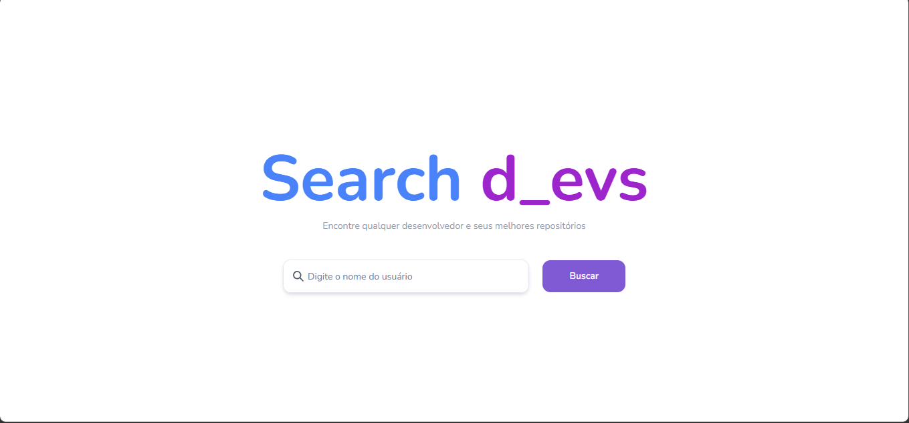
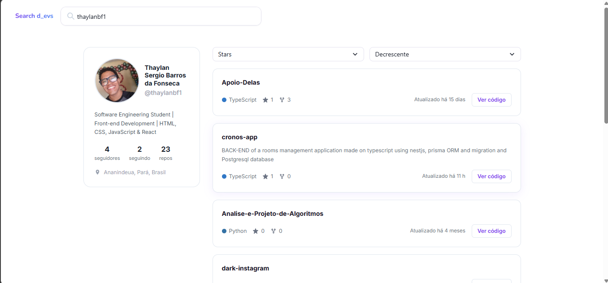
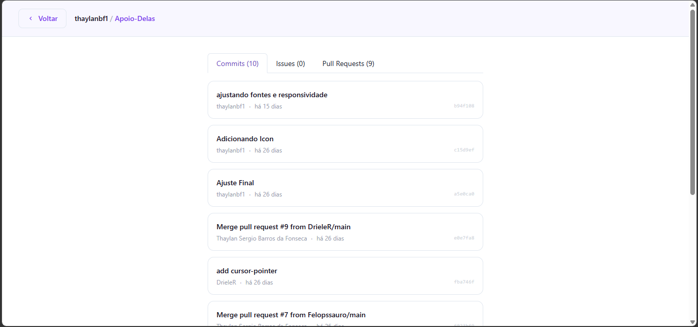

# Search Devs

A web application to search GitHub users and explore their repositories, commits, issues and pull requests — consuming data directly from the official GitHub API.

---

## Goal

Practice and consolidate core frontend development concepts with React, including:

- Consuming external REST APIs
- State and side-effect management with hooks
- Infinite scroll with `IntersectionObserver`
- Runtime data validation with Zod
- Client-side routing with React Router DOM
- Internationalization with i18next
- Component architecture and code organization

---

## Demo





---

## Features

- Search GitHub users by **username or full name**
- Display avatar, bio, location, email, blog, Twitter and LinkedIn
- List repositories with **infinite scroll** (10 per page)
- **Sort repositories** locally by stars, creation date, last update, last push or name — without extra API calls
- Repository detail page with **Commits**, **Issues** and **Pull Requests** tabs
- Error screen with an inline search field so the user can try again without navigating back
- Responsive interface

---

## Technical decisions

---

### TypeScript — Static typing

**Why:**
Plain JavaScript gives no guarantee that API responses match the expected shape — bugs would only surface at runtime. TypeScript adds static typing so errors are caught during development, before the app runs.

**How:**
Data types are defined via Zod schemas and inferred with `z.infer<>`, keeping validation and typing in sync:

```typescript
export const UserSchema = z.object({
  avatar_url: z.string().url(),
  login: z.string(),
  name: z.string().nullable(),
  location: z.string().nullable(),
  bio: z.string().nullable(),
  followers: z.number(),
  following: z.number(),
  public_repos: z.number(),
  email: z.string().nullable(),
  blog: z.string().nullable(),
  twitter_username: z.string().nullable(),
  linkedin_username: z.string().nullable().optional(),
})

export type UserProps = z.infer<typeof UserSchema>
```

---

### React — UI and state management

**Why:**
React lets you describe the UI declaratively for each possible state (loading, success, error) without manually touching the DOM.

**How:**
The app is split into routes (`Home`, `Repos`, `RepoDetails`) and reusable components (`User`, `Repo`, `Search`, `Loader`, `Error`, `BackBtn`). Hooks like `useState`, `useEffect`, `useCallback` and `useMemo` handle state, side effects and performance:

```tsx
// Local sort — no extra API call on sort/direction change
const sortedRepos = useMemo(() => {
  const sorted = [...repos]
  sorted.sort((a, b) => { ... })
  return sorted
}, [repos, sort, direction])
```

---

### React Router DOM — Client-side routing

**Why:**
To navigate between pages without a full browser reload, keeping the SPA experience.

**How:**
Three main routes are defined with `createBrowserRouter`:

```tsx
const router = createBrowserRouter([
  {
    path: '/',
    element: <App />,
    children: [
      { path: '/', element: <Home /> },
      { path: '/profile/:username', element: <Repos /> },
      { path: '/profile/:username/:reponame', element: <RepoDetails /> },
    ],
  },
])
```

---

### Zod — Runtime data validation

**Why:**
The GitHub API can return null, missing or unexpected fields. Zod validates data at runtime and throws clear errors if the contract is broken, preventing silent bugs.

**How:**
`UserSchema` and `RepoSchema` are applied right after each request:

```typescript
const parsedUser = UserSchema.parse(userData)
const parsedRepos = RepoSchema.array().parse(reposData)
```

---

### Infinite scroll — IntersectionObserver

**Why:**
Loading all repositories at once could generate hundreds of requests and slow down the UI. Infinite scroll loads 10 at a time, on demand.

**How:**
An invisible sentinel element is placed at the bottom of the list. `IntersectionObserver` detects when it enters the viewport and triggers the next page load:

```tsx
observerRef.current = new IntersectionObserver((entries) => {
  if (entries[0].isIntersecting) loadMore()
}, { threshold: 1.0 })

if (sentinelRef.current) observerRef.current.observe(sentinelRef.current)
```

---

### Local sorting — no API flooding

**Why:**
Previously, every sort/direction change triggered a new API request. Sorting was moved to the frontend using `useMemo`, applying sort over already-loaded data with zero extra calls.

---

### Tailwind CSS — Utility-first styling

**Why:**
Utility-first approach that lets you apply styles directly in JSX without separate CSS files, speeding up development and keeping visual consistency.

---

### Chakra UI — Accessible components

**Why:**
Components like `Input`, `Select`, `Tabs`, `Spinner`, `Alert` and `Badge` require complex behaviors and accessibility support. Chakra delivers this out of the box with a customizable theme.

**How:**
`ChakraProvider` wraps the entire app. Chakra components are used alongside Tailwind classes:

```tsx
<ChakraProvider resetCSS={false}>
  <RouterProvider router={router} />
</ChakraProvider>
```

---

### i18next — Internationalization

**Why:**
To support multiple languages in the UI without duplicating components.

**How:**
The `useTranslation` hook is used across components to render translated strings:

```tsx
const { t } = useTranslation()
<option value="stargazers">{t('repos.sort.stars')}</option>
```

---

### Error handling

**Why:**
The GitHub API returns `404` for unknown users and `403` when the 60 req/hour rate limit is hit. Without handling, the app would break silently.

**How:**
`try/catch/finally` blocks centralize all error handling. On the error screen, the user can search again without navigating back:

```tsx
{error && <Error loadUser={loadUser} />}
```

---

## API

- **GitHub REST API** — public endpoint, no authentication required for basic data
- Docs: https://docs.github.com/en/rest
- Rate limit: **60 requests per hour** without authentication

Endpoints used:

| Endpoint | Description |
|---|---|
| `GET /users/{username}` | User profile |
| `GET /search/users?q={query}` | Search by username |
| `GET /users/{username}/repos` | User repositories |
| `GET /repos/{username}/{repo}/commits` | Repository commits |
| `GET /repos/{username}/{repo}/issues` | Issues and Pull Requests |

---

## Running the project

```bash
# Clone the repository
git clone https://github.com/thaylanbf1/Search-Devs.git

# Enter the folder
cd Search-Devs

# Install dependencies
npm install

# Start the dev server
npm run dev
```
---

## Author

Developed by **Thaylan Fonseca**  
GitHub: [@thaylanbf1](https://github.com/thaylanbf1)