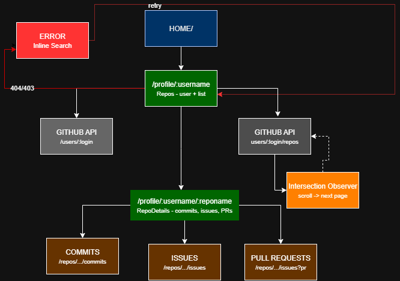
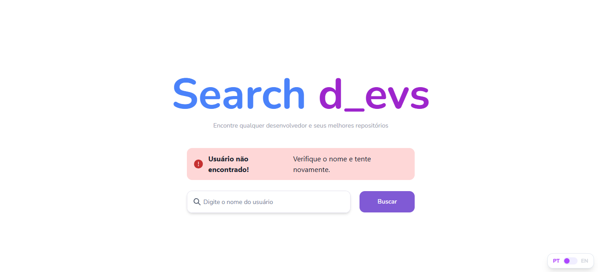

# Search Devs

A web application to search GitHub users and explore their repositories, commits, issues, and pull requests — consuming data directly from the official GitHub API.

---

## Goal

Practice and consolidate core frontend development concepts with React, including:

- Consuming external REST APIs
- State and side-effect management with hooks
- Custom infinite scroll using the native `IntersectionObserver` API
- Runtime data validation with Zod
- Client-side routing with React Router DOM
- Internationalization (i18n) with i18next
- Component architecture and code organization

---

## Navigation Flow

> Simplified diagram to illustrate how the user navigates through the application.



The application has three main routes. On the **Home** page (`/`), the user searches for a GitHub username and is redirected to the **Repos** page (`/profile/:username`), which fetches data from two API endpoints: one to load the user profile and another to list their repositories. The listing uses **Infinite Scroll** via `IntersectionObserver`, which detects when the user reaches the bottom of the list and automatically fetches the next page. Clicking on a **repository name** opens the repository directly on GitHub in a new tab. By clicking **view history**, the user is taken to **RepoDetails** (`/profile/:username/:reponame`), where they can switch between the Commits, Issues and Pull Requests tabs, each consuming its own endpoint — and each item links directly to its corresponding page on GitHub. If the username is not found or the API rate limit is reached, the application displays an **error** screen with an inline search field to try again.

## Demo




---

## Features

- Search GitHub users by **username**
- Display avatar, bio, location, email, blog, Twitter, and LinkedIn
- List repositories with **infinite scroll** (10 per page)
- **Dynamic Filters**: Filter repositories by programming language or type (Sources vs. Forks)
- **Local Sorting**: Sort repositories by stars, forks, creation date, last update, or name — processed client-side to avoid API flooding
- Repository detail page with **Commits**, **Issues**, and **Pull Requests** tabs
- Inline error message with a search field so the user can try again without navigating back
- Fully responsive interface
- Multi-language support (Internationalization)

---

## Technical Decisions

### TypeScript & Zod — Compile-time vs. Runtime Safety

Plain JavaScript gives no guarantee that API responses match the expected shape, meaning bugs often surface unexpectedly. While TypeScript adds static typing to catch errors during development, it only provides safety at *compile-time* and has no control over what an external API actually sends to the browser.

To solve this, **Zod** was implemented to act as a runtime "bodyguard." If the GitHub API changes its contract or sends an unexpected data type (like a missing or null field), Zod parses and validates the payload at runtime. It strips out unexpected data and catches errors before they reach the React components, preventing silent crashes and hard-to-trace bugs. By combining it with TypeScript via `z.infer<>`, typing and validation stay perfectly in sync.

### React Router DOM — Client-side Routing

Used to navigate between pages without a full browser reload, maintaining a fast and seamless Single Page Application (SPA) experience.

### Infinite Scroll — Native IntersectionObserver

Loading all repositories at once could generate dozens of requests and freeze the UI. On the other hand, relying on third-party libraries for infinite scrolling often adds unnecessary bloat to the final bundle size.

Instead, a custom infinite scroll was built using the native `IntersectionObserver` API. It is highly performant because it observes elements asynchronously without running on the main thread (unlike traditional scroll event listeners). It loads 10 items at a time, providing a much smoother User Experience (UX), especially on mobile devices.

### Filtering and Sorting — Client-side Processing

The unauthenticated GitHub API has a strict rate limit of 60 requests per hour. If every filter or sort change triggered a new HTTP request, the application would quickly hit this limit and break.

To prevent this, filtering and sorting are delegated to the frontend using the `useMemo` hook. Working in conjunction with the Infinite Scroll (which gradually populates a local state cache), it allows the user to manipulate the list instantly without triggering new network requests. This results in a highly responsive UI while strictly preserving API quotas.

### Tailwind CSS & Chakra UI — Styling and Accessibility

Tailwind provides utility-first styling for rapid development. Chakra UI was integrated to deliver complex, accessible components (like Selects, Tabs, and Spinners) out of the box with consistent behavior across browsers.

---

## API

- **GitHub REST API** — public endpoint, no authentication required for basic data
- Docs: https://docs.github.com/en/rest
- Rate limit: **60 requests per hour** without authentication

Endpoints used:

| Endpoint | Description |
|---|---|
| `GET /users/{username}` | User profile |
| `GET /search/users?q={query}` | Search by username |
| `GET /users/{username}/repos` | User repositories |
| `GET /repos/{username}/{repo}/commits` | Repository commits |
| `GET /repos/{username}/{repo}/issues` | Issues and Pull Requests |

---

## Running the Project

### 💻 Prerequisites
Before you begin, ensure you have the following installed on your machine:
* **[Git](https://git-scm.com/)**: To clone the repository.
* **[Node.js](https://nodejs.org/en/)**: The runtime environment. The **LTS** version (v18.x or higher) is recommended.
* **npm** (or Yarn/pnpm): The package manager, which comes pre-installed with Node.js.

> **💡 Editor Tip:** For the best development experience, it is highly recommended to use [VS Code](https://code.visualstudio.com/) along with the *Tailwind CSS IntelliSense*, *ESLint*, and *Prettier* extensions.

```bash
# 1. Clone the repository
git clone https://github.com/thaylanbf1/Search-Devs.git

# 2. Enter the project folder
cd Search-Devs

# 3. Install all dependencies
npm install

# 4. Start the local development server
npm run dev
```

After running the final command, the terminal will display a local link (usually http://localhost:5173 or http://localhost:3000). Just click it or copy it into your browser to see the app running!

---

## Author

Developed by **Thaylan Fonseca**  
GitHub: [@thaylanbf1](https://github.com/thaylanbf1)
